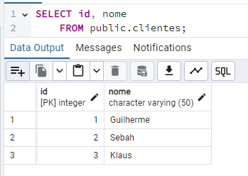
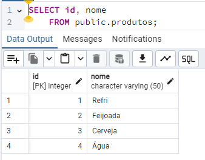
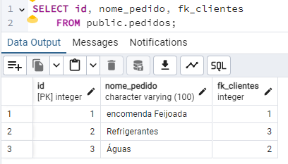
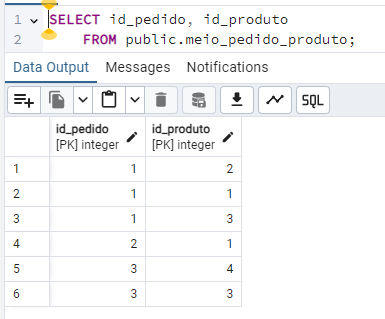
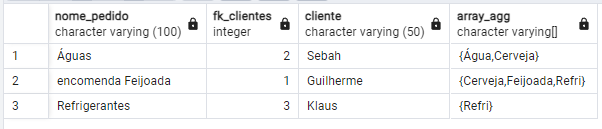

# sql_agregacao

Desenvolvimento para estudar a criação de uma pesquisa SQL em tabela com relacionamento _one to many_ ou 1X

⚠️ O SQL com a criação e inserção dos dados encontra-se na pasta SQL.

⚠️ A tabela meio_pedido_produto tem o relacionamento 1X entre a tabela pedido e produtos

## ⬜ Tabelas

[]

[]

[]

[]

### SQL da pesquisa

```sql
SELECT p.nome_pedido,p.fk_clientes,
	   clientes.nome as cliente,
	   array_agg(DISTINCT prod.nome)

FROM pedidos as p
LEFT JOIN clientes ON p.fk_clientes = clientes.id
LEFT JOIN meio_pedido_produto as meio ON meio.id_pedido = p.id
LEFT JOIN produtos as prod ON prod.id = meio.id_produto
GROUP BY 1,2,3
```

- a saída do comando acima é

[]
